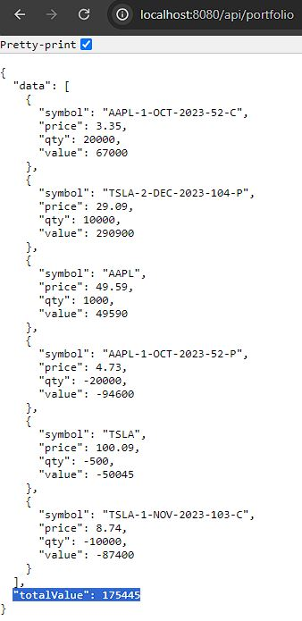
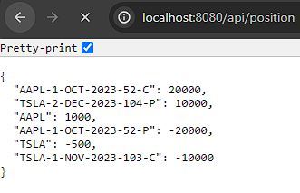

# Portfolio Management System

### Overview

This Java project implements a simplified Portfolio Management System, catering to traders' needs for real-time portfolio value tracking. The system handles three types of products: Stocks, European Call options, and European Put options.

### Modules

1. **portfolio:**
   - `Portfolio`: Class managing overall portfolio.

2. **position:**
   - `Position`: Has symbol, price, qty and marketValue as attributes. Price is taken from underlying stock price
   - `StockPosition`: Child class of `Position`, stores the Stock object.
   - `OptionPosition`: Child class of `Position`, stores the Option object.

3. **options:**
   - `Option`: Has symbol, timeToMaturity, strikePrice and volitility as attributes

4. **stocks:**
   - `Stock`: Has symbol, price, expectedReturn and annualizedStdDev as attributes. Price is updated periodically between 0.5 and 2 seconds.
   

### Implementation Highlights

#### Option pricing based on European option pricing formulas.
- Results used in unit test to verify the correctness of the implementation.

#### Mock market data provider generating stock prices with random pricing or geometric Brownian motion.

#### Overall portfolio tracking of market values. Updated in real-time when stock prices change.

#### Positions info taken from CSV

#### Options info taken from embedded H2 DB

